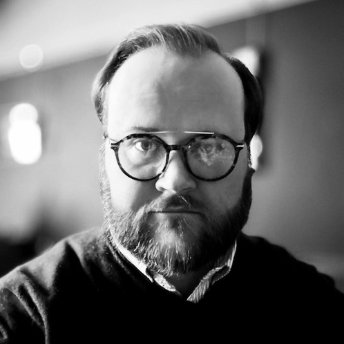

# About Me

Hello, I'm Ashley. I don't have much else to share at the moment.
            
# Links

 * <a href="https://www.linkedin.com/in/ashleylharnett/" target="_blank" title="LinkedIn">LinkedIn</a>, for talking about work.
 * <a href="https://github.com/ashleylharnett/" target="_blank" title="GitHub">GitHub</a>, for code.

# Work

I'm currently working as an independent IT consultant, specialising in HE student systems. That's probably not what you're interested in but feel free to get in touch if you are.
            
# Education

 * <abbr title="Master of Arts">MA</abbr> English, The Open University (2020).
 * <abbr title="Bachelor of Arts with Honours">BA (Hons)</abbr> Ancient History &amp; Classical Archaeology, University of Warwick (2011).